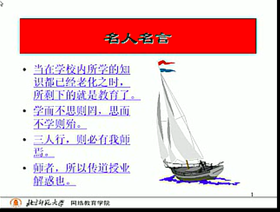
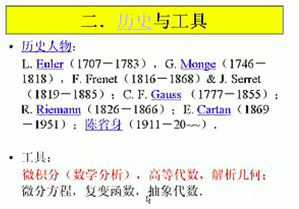
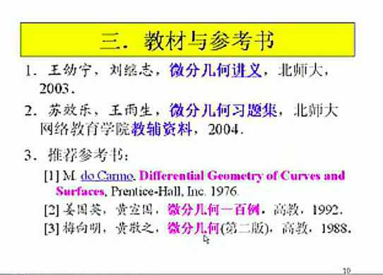

[视频教程-王幼宁](https://www.bilibili.com/video/av7471669?from=search&seid=14125137270473807725)

### 微分几何001-导论

指导思想:

课程内容:

#### 1、研究对象
$E^3$中曲线、曲面的几何对象。
----不依赖解析表示的性质。

> $E^3$,欧式空间;$R^3$,向量空间

#### 2、历史与工具

#### 3、参考书

<全文结束>
