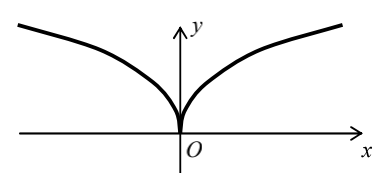
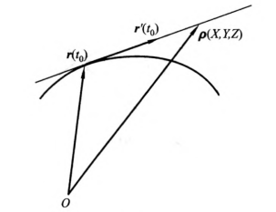
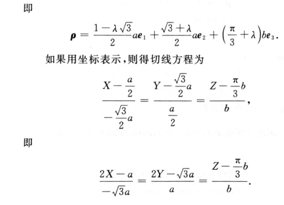
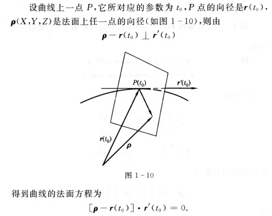

> 出处: 微分几何 梅向明 第四版

#### 1、曲线的定义
曲线可以用向量函数表示:
$$
\pmb{r}(t)
= x(t)\pmb{e_1}
+y(t)\pmb{e_2}
+z(t)\pmb{e_3},
a<t<b
$$

位置向量终点全体:
$$
C=\{x(t),y(t),z(t)\},t\in(a,b)
$$

示例1圆:
$$
C = \{cos \:t, sin \:t\},t\in(0,2\pi)
$$

#### 2、光滑曲线
如果曲线$\pmb{r}(t)$是$k$阶连续可微的,则把曲线称为$C^k$**类曲线**。当k=1时,也就是$C^1$类的曲线,右称为**光滑曲线**。

#### 3、正常点
给出$C^1$类的曲线$\pmb{r}=\pmb{r}(t)$,假设对于曲线上一点$t=t_0$有:
$$
\pmb{r}'(t_0) \ne \pmb{0}
$$
则这一点称为曲线的**正常点**。

注意$\pmb{r}'(t) \ne \pmb{0}$,表示$x'(t),y'(t),z'(t)$中至少有一个不为零。

若曲线点点正常,则称曲线为**正则曲线**。

示例:
$$
\pmb r(t) = (t^3 , t^2 , 0) , t∈R ，
$$

则:
$$
\pmb r'(t) = (3t^2 , 2t , 0)
$$

故此时其**奇点**有且仅有一个：r(0)。

#### 4、曲线的切线
曲线一点的切向量:
$$
\pmb r'(t_0)
=\lim_{\Delta t \to 0}{\frac{r(t_0+\Delta t) - r(t_0)}{\Delta t}}
= \frac{dr}{dt}(t_0)
$$

向径: 有方向的半径。

$u$为切线上的参数,向量形式的切线方程:
$$
\pmb p(u) = \pmb r(t_0) + u\pmb r'(t_0), u \in R
$$

坐标形式的切线方程:
$$
\frac{x-x(t_0)}{x'(t_0)} =
\frac{y-y(t_0)}{y'(t_0)} =
\frac{z-z(t_0)}{z'(t_0)}
$$

示例:
求 $\pmb r(t) = \{acos \: t, asin \: t,bt\}$在$t=\pi/3$处的切线方程。
$$
\pmb r(t) = \{acos \: t, asin \: t,bt\}
$$

$$
\pmb r('t) = \{-asin \: t, acos \: t,b\}
$$

$t = \pi/3$时:
$$
\pmb r(\pi/3) = \{a/2, \sqrt{3} a /2, \pi b/3\}
$$

$$
\pmb r'(\pi/3) = \{-\sqrt{3} a /2, a /2, b\}
$$

所以切线方程为:
$$
\pmb p(u) =\pmb r(\pi/3) + u \pmb r'(\pi/3)
$$

即:
$$
\pmb p(u) =\pmb r(\pi/3) + u \pmb r'(\pi/3)
$$

#### 5、曲线的法平面
经过切点,法线方向是切线方向的平面,称为**法平面**或**法面**。

