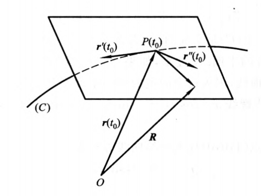

#### 1、密切平面(osculating plane)
> https://baike.baidu.com/item/%E5%AF%86%E5%88%87%E5%B9%B3%E9%9D%A2

> https://www.chegg.com/learn/calculus/calculus/osculating-plane

定义:
空间曲线上P点的切线和曲线上与P点的邻近一点Q可作一平面$\sigma$，当Q点沿着曲线趋近于P时，平面σ的极限位置π称为曲线在P点的**密切平面**。

等价定义：
过空间曲线上点P和曲线上它充分靠近的点$\pmb r(t_0+\Delta t)$， 作一平面。当$\Delta t$趋近于零时，平面的极限位置称为曲线的P点处的**密切平面**。

向量PQ可以表示为:
$$
\overrightarrow {PQ} = \pmb r(t_0+\Delta t) - \pmb r(t_0)
$$

根据泰勒级数展开:
$$
\overrightarrow {PQ} =
\pmb r'(t_0)\Delta t +
\frac{1}{2} r''(t_0) \Delta t^2 + o(\Delta t^2 )
$$

其中:
$$
\lim_{\Delta t \to 0} o(\Delta t^2) = 0
$$

因为向量$\overrightarrow{PQ}$和向量$\pmb r'(t_0)$都在平面$\sigma$上,所以他们的线性组合$\pmb r''(t_0)$也在平面上:
$$
\pmb r''(t_0) =
\frac{2}{\Delta t^2} (\overrightarrow {PQ} - \pmb r'(t_0)) -
o(\Delta t^2 )
$$

当Q点沿着曲线趋近于P时,$\Delta t \to 0$,这时$\pmb r'(t_0)$不动,但$o(\Delta t^2 ) \to 0$,这个线性组合向量就趋于$\pmb r''(t_0)$,所以平面$\sigma$的极限位置是向量$\pmb r'(t_0)$和$\pmb r''(t_0)$所确定的平面。

综上,曲线在$P(t_0)$的切平面方程是:
$$
(\pmb R-\pmb r(t_0), \pmb r'(t_0),\pmb r''(t_0)) = 0
$$

其中:$\pmb R = \{X,Y,Z\}$表示P点的密切向量的任一点向径。

行列式表示:
$$
\left | \begin{matrix}
X-x(t_0) & Y-y(t_0) & Z-z(t_0) \\
x'(t_0)& y'(t_0) & z'(t_0) &  \\
x''(t_0)& y''(t_0) & z''(t_0) &  \\
\end{matrix}
\right | = 0
$$

示例1,求螺线 x=cos t,y=sin t,z = t上一点(1,0,0)上的密切平面。
所给曲线的参数方程:
$$
\pmb r(t) = \{cos t, sin t, t\}
$$

可以求出:
$$
\pmb r'(t) = \{-sin t, cos t, 1\} \\
\pmb r''(t) = \{-cos t, -sin t, 0\}
$$

把点(1,0,0)代入曲线方程得t=0.代入得:
$$
\pmb r(0) = \{1, 0, 0\} \\
\pmb r'(0) = \{0, 1, 1\} \\
\pmb r''(0) = \{-1, 0, 0\} \\
$$

所以所求密切平面方程为:
$$
\left | \begin{matrix}
X-1 & Y & Z \\
0& 1 &1 &  \\
-1& 0 &0 &  \\
\end{matrix}
\right |
$$

即:
$$
-Y +Z = 0
$$
