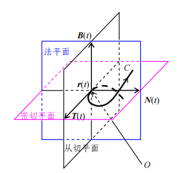

### Frenet 标架
设曲线C的弧长参数是: $\pmb r(s)$

**切向量(T)**:
$$
\pmb T(s) = \pmb r'(s)
$$

因为 T(s)的模长恒定,所以, $\pmb T(s) \perp \pmb T'(s) $

**主法向量(N)**:
$$
\pmb N(s) = \pmb T'(s)
$$

**服法向量(B):**
$$
\pmb B(s) = \pmb T(s) \times \pmb N(s)
$$

**法平面**: 以切向量(T)为法线的平面
**从切平面**: 以主法线(N)为法线的平面
**密切平面**: 以副法线(B)为法线的平面

