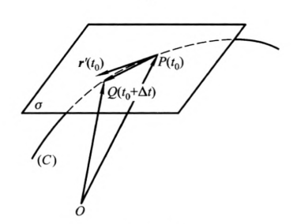

#### 1、密切平面(osculating plane)
> https://baike.baidu.com/item/%E5%AF%86%E5%88%87%E5%B9%B3%E9%9D%A2

定义:
空间曲线上P点的切线和曲线上与P点的邻近一点Q可作一平面$\sigma$，当Q点沿着曲线趋近于P时，平面σ的极限位置π称为曲线在P点的**密切平面**。

等价定义：
过空间曲线上点P和曲线上它充分靠近的点$\pmb r(t_0+\Delta t)$， 作一平面。当$\Delta t$趋近于零时，平面的极限位置称为曲线的P点处的**密切平面**。

向量PQ可以表示为:
$$
\overrightarrow {PQ} = \pmb r(t_0+\Delta t) - \pmb r(t_0)
$$

根据泰勒级数展开:
$$
\overrightarrow {PQ} =
\pmb r'(t_0)\Delta t +
\frac{1}{2} r''(t_0) \Delta t^2 + o(\Delta t^2 )
$$

其中:
$$
\lim_{\Delta t \to 0} o(\Delta t^2) = 0
$$

因为向量$\overrightarrow{PQ}$和向量$\pmb r'(t_0)$都在平面$\sigma$上,所以他们的线性组合$\pmb r''(t_0)$也在平面上:
$$
\pmb r''(t_0) =
\frac{2}{\Delta t^2} (\overrightarrow {PQ} - \pmb r'(t_0)) -
o(\Delta t^2 )
$$

当Q点沿着曲线趋近于P时,$\Delta t \to 0$,这时$\pmb r'(t_0)$不动,但$o(\Delta t^2 ) \to 0$,这个线性组合向量就趋于$\pmb r''(t_0)$,所以平面$\sigma$的极限位置是向量$\pmb r'(t_0)$和$\pmb r''(t_0)$所确定的平面。
