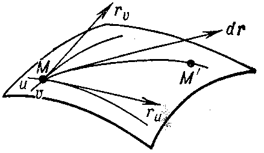

> https://encyclopediaofmath.org/wiki/Fundamental_forms_of_a_surface

### 第一基本形式
给出曲面S：
$$
\pmb r = \pmb r(u,v)
$$

微分形式:
$$
d\pmb r = \pmb r_u du + \pmb r_v dv
$$

曲面S上任意一点的切平面由向量$\pmb r_u, \pmb r_v$张成。

$d\pmb r$模长的平方:
$$
d\pmb r • d\pmb r =
(\pmb r_u • \pmb r_u) du^2 +
2(\pmb r_u • \pmb r_v) dudv +
(\pmb r_v • \pmb r_v) dv^2
$$

令：
$$
E = \pmb r_u • \pmb r_u \\
F = \pmb r_u • \pmb r_v \\
G = \pmb r_v • \pmb r_v
$$

曲线S的**第一个基本形式**用$I$表示：
$$
I = Edu^2+Fdudv + Gdv^2
$$
那么第一个基本形式是切向量的内积。

