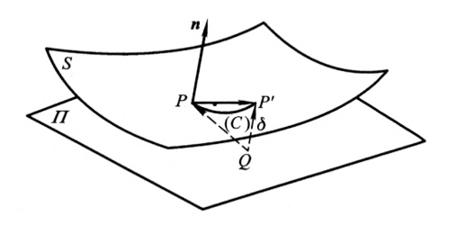

### 曲面的第二基本形式

由于
$$
\overrightarrow {QP} \cdot \pmb n = 0
$$

则点 P'到切平 面 $\pi$的有向距离为:
$$
\begin{aligned}
\delta &= \overrightarrow {QP'} \cdot \pmb n \\
      &= (\overrightarrow {QP} + \overrightarrow {PP'}) \cdot \pmb n \\
      &= \overrightarrow {PP'} \cdot \pmb n
\end{aligned}
$$

其中:
$$
\overrightarrow {PP'} = \Delta \pmb r
$$

由Taylor 展开式:
$$
\begin{aligned}
\Delta \pmb r &= d \pmb r + \frac{1}{2} d^2 \pmb r + o(du^2+dv^2) \\
\end{aligned}
$$

由于:
$$
d \pmb r \cdot \pmb n = 0
$$

所以:
$$
\begin{aligned}
\delta &= \frac{1}{2} d^2 \pmb r \cdot \pmb n + o(du^2+dv^2) \\
 &\approx \frac{1}{2} d^2 \pmb r \cdot \pmb n \\
 &= \frac{1}{2} ( \pmb r_{uu} du^2 + 2 \pmb r_{uv} dudv + \pmb r_{vv} dv^2) \cdot \pmb n
\end{aligned}
$$

引进符号:
$$
L = \pmb r_{uu} \cdot \pmb n \\
M = \pmb r_{uv} \cdot \pmb n \\
N = \pmb r_{vv} \cdot \pmb n \\
$$

曲面的第二基本形式:
$$
II = L du^2 + 2M dudv + N dv^2
$$

